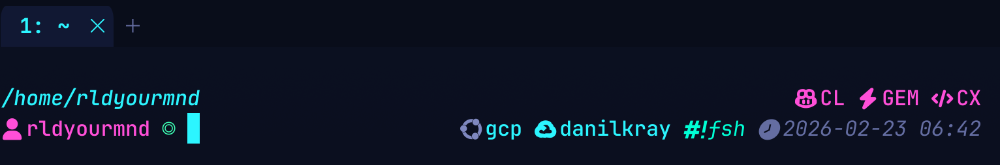

# Awesome Terminal for AI

<p align="center">
  <a href="https://github.com/rldyourmnd/awesome-terminal-for-ai">
    
  </a>
</p>

<p align="center">
  <strong>Cross-platform terminal environment for Linux, macOS, and Windows with OS-first structure, layered installers, and production-grade validation.</strong>
</p>

<p align="center">
  <a href="https://github.com/rldyourmnd/awesome-terminal-for-ai/actions/workflows/ci.yml">
    
  </a>
  <a href="https://github.com/rldyourmnd/awesome-terminal-for-ai/releases/tag/v2.0.2">
    
  </a>
  <a href="LICENSE">
    
  </a>
</p>

## OS-First Navigation

| Platform | Status | Install | Dry-run | Health check | Docs |
| --- | --- | --- | --- | --- | --- |
| Linux (Debian/Ubuntu) | Production | `./scripts/install.sh` | `./scripts/install.sh --dry-run` | `./scripts/health-check.sh --summary` | [`docs/platforms/linux/README.md`](docs/platforms/linux/README.md) |
| macOS | Production | `./scripts/install.sh` or `./scripts/install-macos.sh` | `./scripts/macos/install.sh --dry-run` | `./scripts/health-check-macos.sh --summary` | [`docs/platforms/macos/README.md`](docs/platforms/macos/README.md) |
| Windows (PowerShell + WinGet) | Production | `.\scripts\install-windows.ps1` | `.\scripts\install-windows.ps1 -DryRun` | `.\scripts\health-check-windows.ps1 -Summary` | [`docs/platforms/windows/README.md`](docs/platforms/windows/README.md) |

## What You Get

- WezTerm + shell + Starship baseline.
- Deterministic 5-layer tooling model.
- OS-dispatched installers with platform-specific implementations.
- Built-in health checks and CI smoke coverage for Linux/macOS/Windows.

## Quick Start

### Linux

```bash
git clone https://github.com/rldyourmnd/awesome-terminal-for-ai.git
cd awesome-terminal-for-ai
./scripts/install.sh
```

### macOS

```bash
git clone https://github.com/rldyourmnd/awesome-terminal-for-ai.git
cd awesome-terminal-for-ai
./scripts/install.sh
```

### Windows (PowerShell)

```powershell
git clone https://github.com/rldyourmnd/awesome-terminal-for-ai.git
cd awesome-terminal-for-ai
.\scripts\install-windows.ps1
```

## Structure (Clean OS Layout)

```text
scripts/
├── install.sh                     # OS dispatcher
├── health-check.sh                # OS dispatcher
├── linux/                         # Linux canonical implementation
├── macos/                         # macOS canonical implementation
├── windows/                       # Windows canonical implementation
├── shared/                        # cross-platform helper scripts
├── install-macos.sh               # wrapper
├── install-windows.ps1            # wrapper
├── health-check-macos.sh          # wrapper
└── health-check-windows.ps1       # wrapper

docs/
├── README.md                      # docs navigation index
├── platforms/
│   ├── linux/
│   │   ├── README.md
│   │   └── reference/             # Linux foundation + layers reference
│   ├── macos/README.md
│   └── windows/README.md
├── operations/
└── assets/

wiki/                              # wiki source (published via script)
```

## Layer Model

| Layer | Scope |
| --- | --- |
| Foundation | Terminal + shell + prompt baseline |
| Layer 1 | File operations (`bat`, `fd`, `rg`, `sd`, `jq`, `yq`, `eza`) |
| Layer 2 | Productivity (`fzf`, `zoxide`, `atuin`, `uv`, `bun`, `watchexec`, `glow`, `btm`, `hyperfine`) |
| Layer 3 | GitHub/Git (`gh`, `lazygit`, `delta`) |
| Layer 4 | Code intelligence (`grepai`, `ast-grep`, `probe`, `semgrep`, `ctags`, `tokei`) |
| Layer 5 | AI orchestration (`claude`, `gemini`, `codex`) |

## Validation and Quality Gates

- Local:

```bash
./scripts/install.sh --dry-run
./scripts/health-check.sh --strict --summary
```

- CI (`.github/workflows/ci.yml`):
  - shell lint + syntax checks,
  - markdown lint,
  - link check,
  - Linux/macOS/Windows flow smoke.

## Documentation and Wiki

- Docs index: [`docs/README.md`](docs/README.md)
- Platform docs: [`docs/platforms/`](docs/platforms/)
- Operations runbooks: [`docs/operations/`](docs/operations/)
- Wiki source: [`wiki/`](wiki/)
- Wiki publish: `./scripts/publish-wiki.sh`
  - requires `gh` installed and authenticated (`gh auth status`)

## Compatibility Notes

Linux layer scripts are now canonical under `scripts/linux/*` (root-level legacy Linux layer wrappers were removed for cleaner UX).

## Contributing

- Read [`CONTRIBUTING.md`](CONTRIBUTING.md)
- Read [`SECURITY.md`](SECURITY.md)
- Open issues: <https://github.com/rldyourmnd/awesome-terminal-for-ai/issues>

## License

MIT — see [`LICENSE`](LICENSE).
